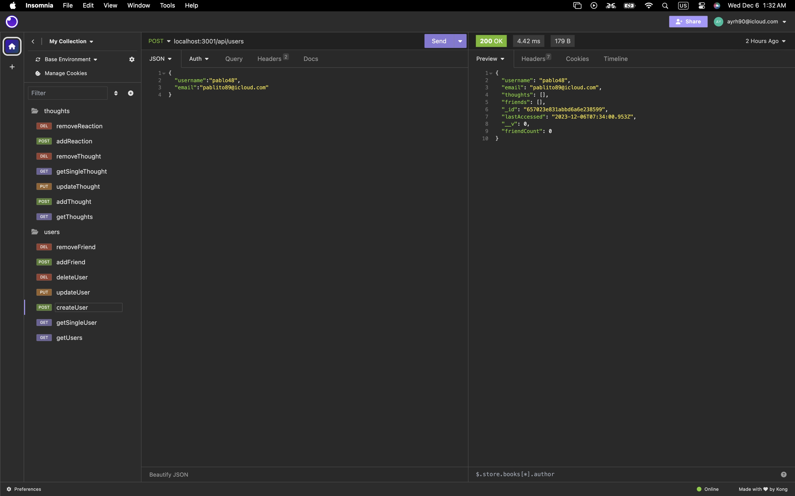

# 15 Socail Database

## Description
this app is a a basic social media database 

## Table of Contents (Optional)
- [Installation](#installation)
- [Usage](#usage)
- [Credits](#credits)
- [License](#license)
- [Features](#Features)
- [Contribute](#Contribute)
- [License](#license)
- [Test](#Test)

## Installation
"dependencies": {
    "express": "^4.17.1",
    "mongoose": "^7.0.2"
  },
  "devDependencies": {
    "nodemon": "^2.0.3"
  }
## Usage

install the listed packages and run application  

## Credits
 * [Erick Hoverstine (tutor)](none)
 * [UCLA BOOTCAMP ACTIVITIES](ACTIVITIES 10 -26)
 * [bootcamp virtual assistant]

## License

## Features
User can lunch application with express, to run database. 

## Contribute
none

## Tests
none

## Questions
 Email: ayrh90@icloud.com
 GitHub: https://github.com/Ayrh1
